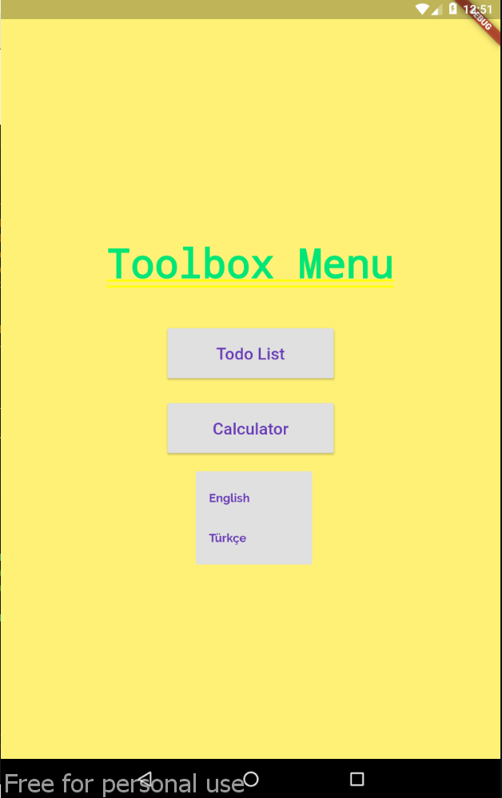
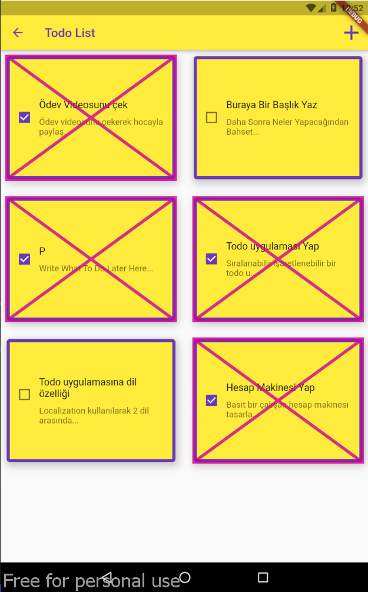
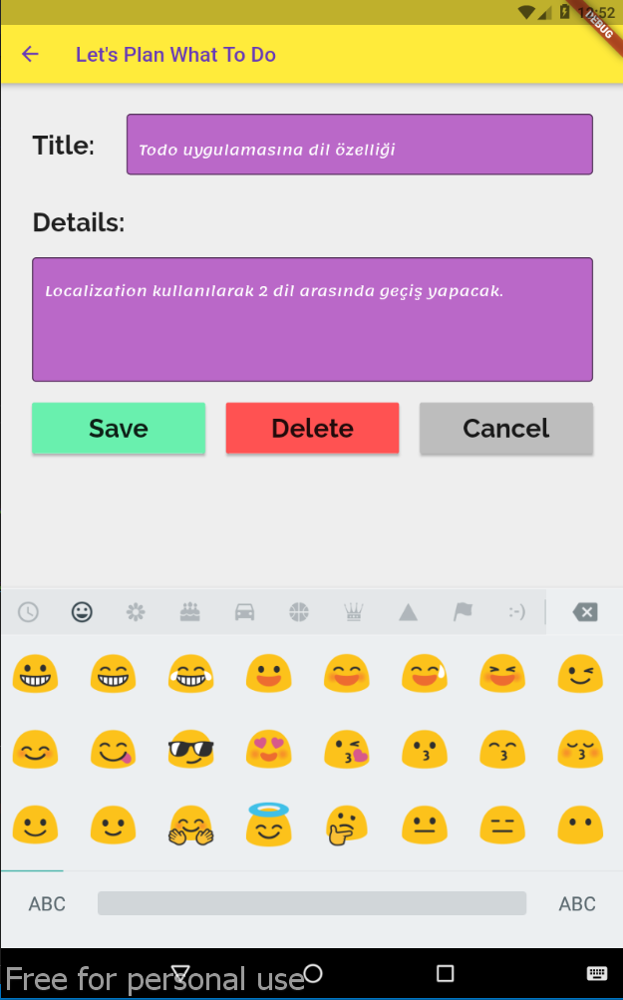
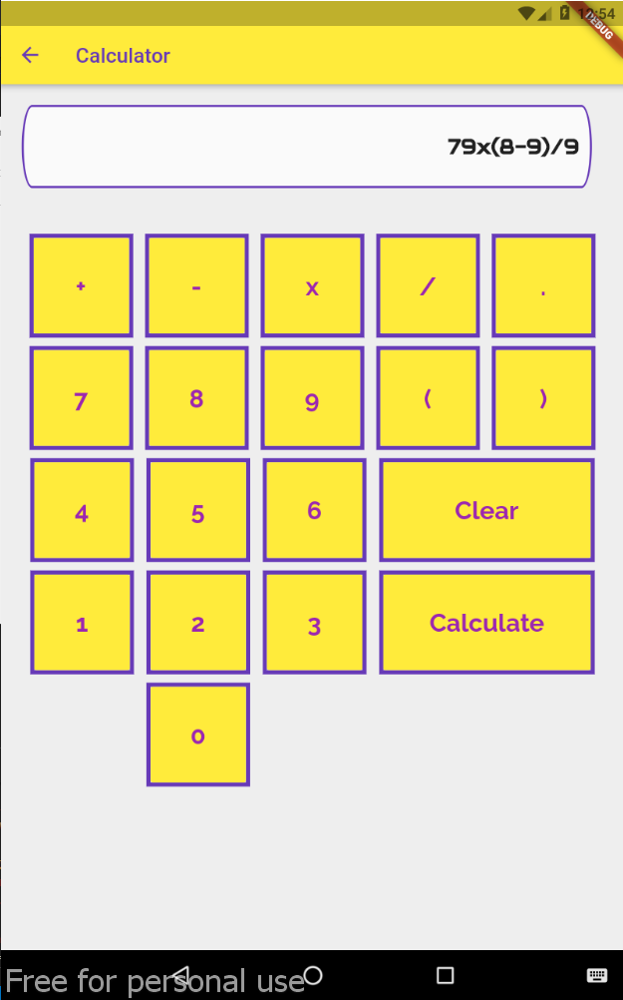
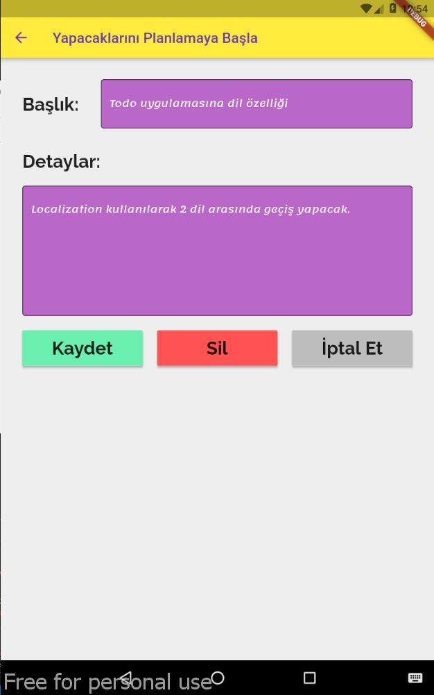

### Project Information
--- 
* Project Name:  
ToolBox
 

* Project Team:  
Fadıl Şahin
 

* Project Start Date:  
May 2021
 

* Project State And Duration:  
Done, 3 days
 

* Project Description:  
Application contains menu page, todo list page, add update and delete todo page, calculator page. At menu page, todo list or calculator can be selected and language can be changed. There is two language support which is english and turkish. In the todo list page, there is a list that is made by using reorderable package. List items can be reordered. Each item has title and description information in limited character and a checkbox to mark the todo item is done or not. In this project, layered architecture used and as a data layer sqlite database and floor orm used. Widget interactions are handled by providers.
 
 

:exclamation: --------------------------------------------------------------------------------- :exclamation:

- ***Usable apk is inside [images-and-apk](images-and-apk/ToolBox.apk) folder***

:exclamation: --------------------------------------------------------------------------------- :exclamation:

### Screenshots
---

### Menu Page 

### Todo List Page

### Add Delete Update Page

### Calculator Page

### Other Language Supported

